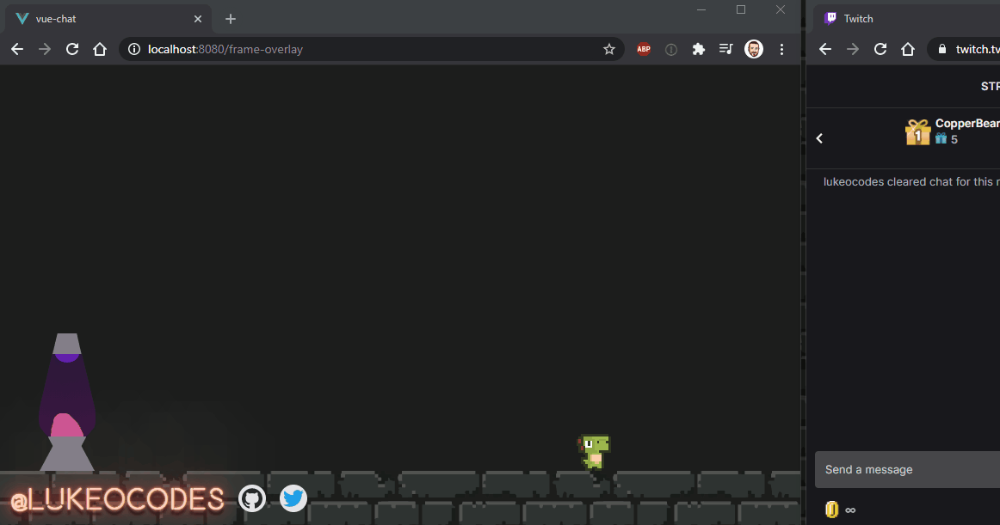
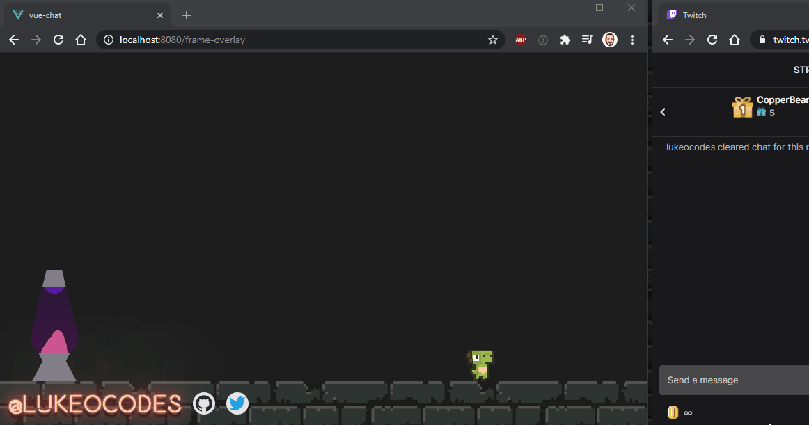
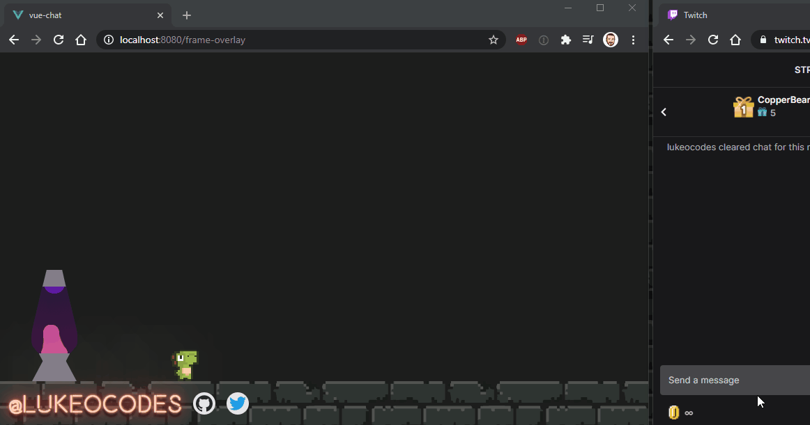
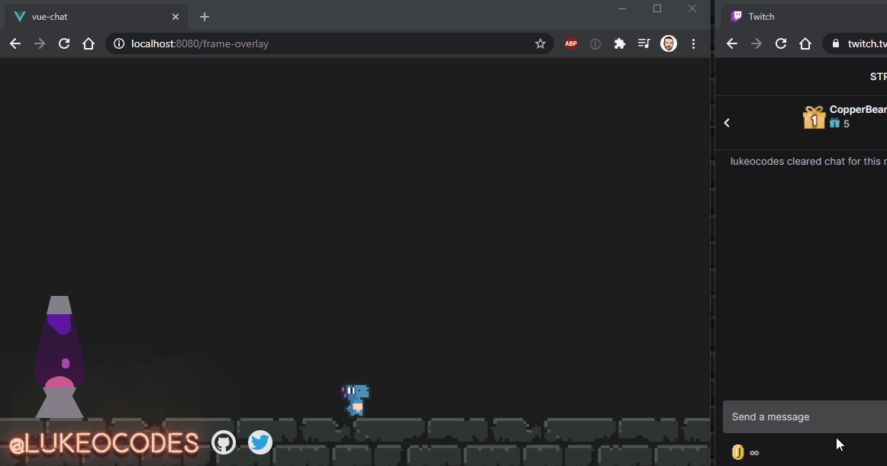
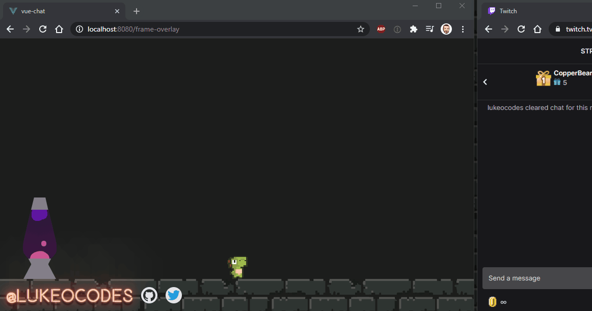
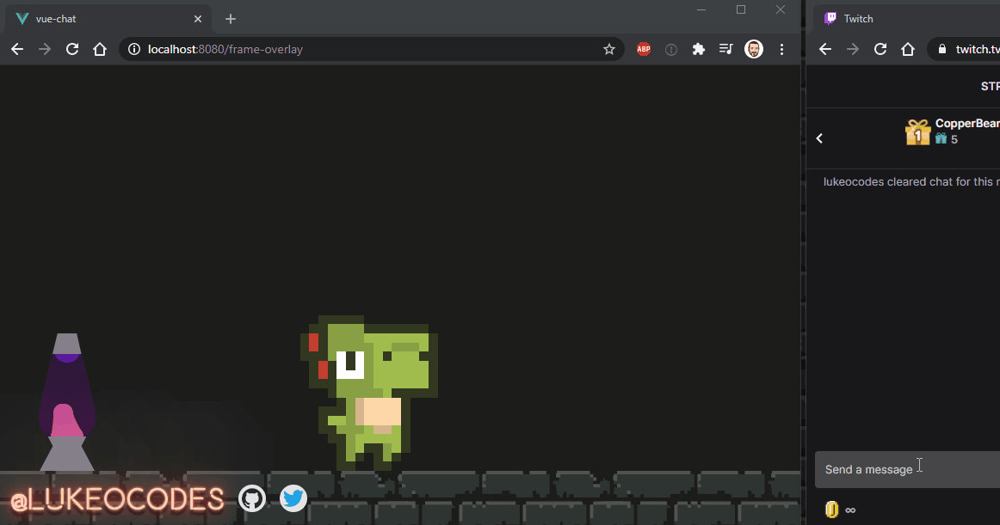
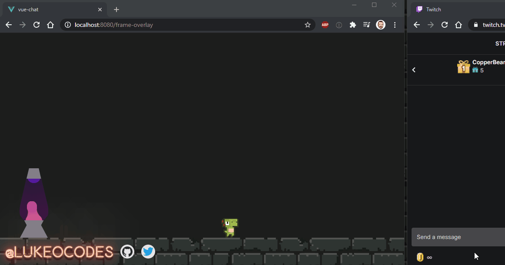
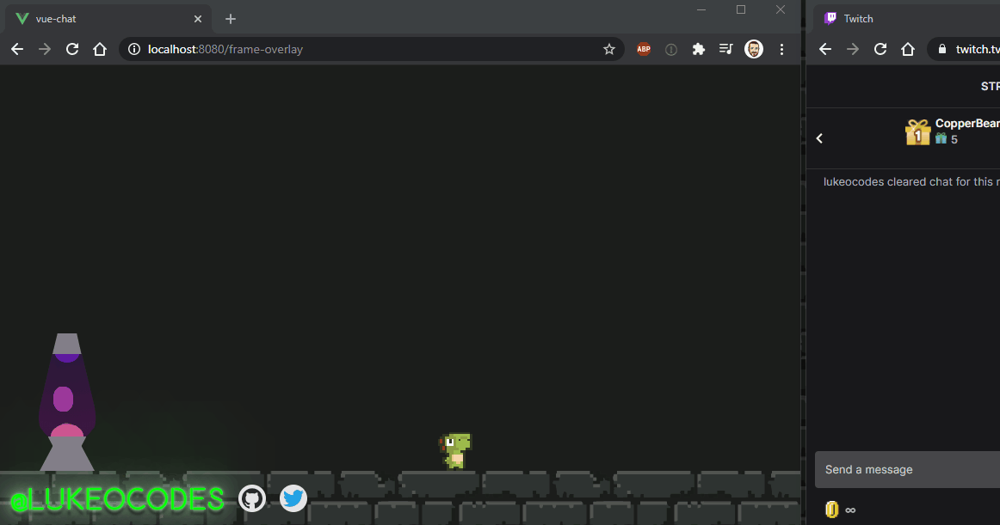
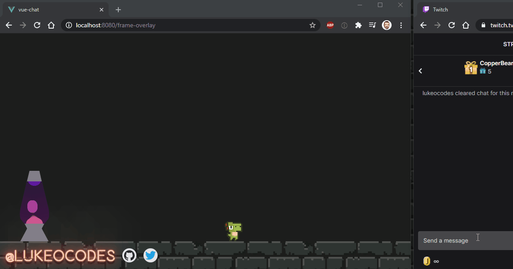
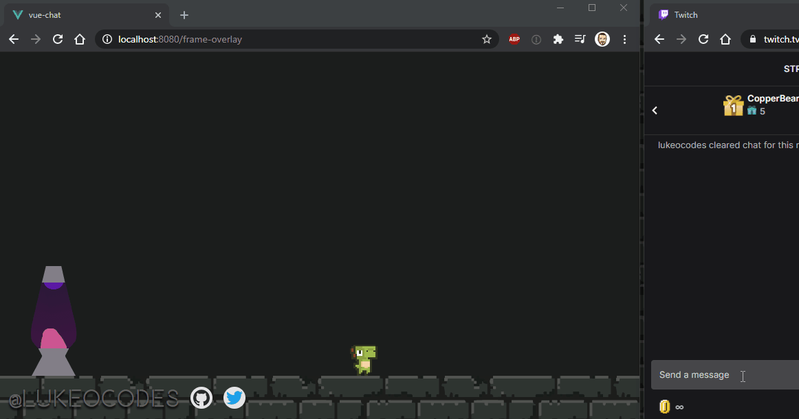

# Comfy Scenes


### An effects maker for Twitch streamers. 

This app will monitor your Twitch channel for `!commands` using [Comfy.js](https://github.com/instafluff/ComfyJS) (by [instafluff](https://github.com/instafluff/ComfyJS#instafluff) and [others](https://github.com/instafluff/ComfyJS#credits)). It can play `.mp3` files, display visual effects, and interact with Vue.js components.

Included in this app are my stream scenes. 

Please FEEL FREE to take these and use them for your own purposes. If you like them, I'd love to hear about what you do with them.

## Credit

Uses, and named after, [Comfy.js](https://github.com/instafluff/ComfyJS) (by [instafluff](https://github.com/instafluff/ComfyJS#instafluff)).

Uses [Dino Characters](https://arks.itch.io/dino-characters) by [ScissorMarks](https://twitter.com/ScissorMarks)


## Demo

You can see this in use, in the wild, by tuning into the [lukeocodes stream](https://twitch.tv/lukeocodes) on Twitch.

## Deploy with Netlify

This can be deployed straight to Netlify, to use in your stream. Just click the button!

[](https://app.netlify.com/start/deploy?repository=https://github.com/lukeocodes/comfy-scenes)

Remember to add/edit `VUE_APP_CHANNEL_NAME` in your deploy environment to the channel name to connect to.

## Current Commands and Actions

### !rain

Triggers the `rainDinos` action, which adds some anonymous dinos to the raid array. The result is spawning some dinos that parachute down the screen.

A raid would do the same, but with usernames visible above the characters, on the scene.

```js
// src/config.js
module.exports = {
  // ...
  rain: {
    action: {
      name: "rainDinos"
    }
  },
}
```



### !kick

Triggers `rainDinos`, then `petKick` and the `hit.mp3` sound effect, then `movePetFast`, in that order. 

The result is that the pet runs over to me, the streamer, kicks me in the face (complete with sound effect), and runs away fast.

```js
// src/config.js
module.exports = {
  // ...
  kick: [
    {
      queue: "pet",
      action: {
        name: "movePetToMe"
      }
    },
    {
      queue: "pet",
      action: {
        name: "petKick"
      },
      sfx: {
        src: "hit.mp3"
      }
    },
    {
      queue: "pet",
      action: {
        name: "movePetFast"
      }
    }
  ],
}
```



### !poke

Triggers `movePet` and the `pop.mp3` sound effect. 

This is just to get the pet moving. It will do this itself (without sound effect) after 150s of inactivity, anyway.

```js
// src/config.js
module.exports = {
  // ...
  poke: {
    queue: "pet",
    action: {
      name: "movePet"
    },
    sfx: {
      src: "pop.mp3"
    }
  },
}
```


### !boo

Triggers `movePetFast` five times, consecutively.

This makes it look as if you've scared the pet and it is running around like a headless chicken. Speed is 300px per second, 3 times the normal run speed.

```js
// src/config.js
module.exports = {
  // ...
  boo: [
    {
      queue: "pet",
      action: {
        name: "movePetFast"
      }
    },
    {
      queue: "pet",
      action: {
        name: "movePetFast"
      }
    },
    {
      queue: "pet",
      action: {
        name: "movePetFast"
      }
    },
    {
      queue: "pet",
      action: {
        name: "movePetFast"
      }
    },
    {
      queue: "pet",
      action: {
        name: "movePetFast"
      }
    }
  ],
}
```



### !dave

Triggers `petDave`, switching the character.

```js
// src/config.js
module.exports = {
  // ...
  dave: {
    action: {
      name: "petDave"
    }
  },
}
```


### !greg

Triggers `petGreg`, switching the character.

```js
// src/config.js
module.exports = {
  // ...
  greg: {
    action: {
      name: "petGreg"
    }
  },
}
```



### !blue

Triggers `petBlue`, switching the character.

```js
// src/config.js
module.exports = {
  // ...
  blue: {
    action: {
      name: "petBlue"
    }
  },
}
```


### !mort

Triggers `petMort`, switching the character.

```js
// src/config.js
module.exports = {
  // ...
  mort: {
    action: {
      name: "petMort"
    }
  },
}
```


### !biggly

Triggers `petGetBiggly`, increasing the size of the pet by 4rem every time.

```js
// src/config.js
module.exports = {
  // ...
  biggly: {
    action: {
      name: "petGetBiggly"
    }
  },
}
```



### !shrink

Triggers `petShrink`, resetting the size of the pet to the default 4rem.

```js
// src/config.js
module.exports = {
  // ...
  shrink: {
    action: {
      name: "petShrink"
    }
  },
}
```



### !bulb #00ff00

Triggers `changeBulb` and the `switch.mp3` sound effect, changing the color of the logo!

Can we used with any hex or rgb color code. i.e. #00ff00 or rgb(0,255,0).

```js
// src/config.js
module.exports = {
  // ...
  bulb: {
    action: {
      name: "changeBulb"
    },
    sfx: {
      src: "switch.mp3"
    }
  },
}
```



### !resetbulb

Triggers `resetBulb` and the `switch.mp3` sound effect, changing the color of the logo to the standard colors.

```js
// src/config.js
module.exports = {
  // ...
  resetbulb: {
    action: {
      name: "resetBulb"
    },
    sfx: {
      src: "switch.mp3"
    }
  },
}
```



### !off

Triggers `lightsOut` and the `switch.mp3` sound effect, turns the neon logo off (just a bevel'd grey logo like the bulb is off).

```js
// src/config.js
module.exports = {
  // ...
  off: {
    action: {
      name: "lightsOut"
    },
    sfx: {
      src: "switch.mp3"
    }
  },
}
```



### !on

Triggers `lightsOn` and the `switch.mp3` sound effect, turns the neon "on" restoring the glow with the colors set by the `!bulb` commands.

```js
// src/config.js
module.exports = {
  // ...
  on: {
    action: {
      name: "lightsOn"
    },
    sfx: {
      src: "switch.mp3"
    }
  },
}
```



### !pop

Triggers the `pop.mp3` sound effect.

```js
// src/config.js
module.exports = {
  // ...
  pop: {
    sfx: {
      src: "pop.mp3"
    }
  },
}
```

### !drop

Triggers the `drop.mp3` sound effect.

```js
// src/config.js
module.exports = {
  // ...
  drop: {
    sfx: {
      src: "drop.mp3"
    }
  },
}
```

### !grounded

Triggers the `grounded.mp3` sound effect, featuring the [Bald Bearded Builder](https://twitch.tv/baldbeardedbuilder).

```js
// src/config.js
module.exports = {
  // ...
  grounded: {
    sfx: {
      src: "grounded.mp3"
    }
  },
}
```

### !energize

Triggers the `transport.mp3` sound effect.

```js
// src/config.js
module.exports = {
  // ...
  energize: {
    sfx: {
      src: "transport.mp3"
    }
  },
}
```

### !absolutely

Triggers the `absolutely.mp3` sound effect. Everything is better with Drag Race.

```js
// src/config.js
module.exports = {
  // ...
  absolutely: {
    sfx: {
      src: "absolutely.mp3"
    }
  },
}
```

### !look

Triggers the `look.mp3` sound effect. Everything is better with Drag Race.

```js
// src/config.js
module.exports = {
  // ...
  look: {
    sfx: {
      src: "look.mp3"
    }
  },
}
```

### !vonage

Triggers the `vonage.mp3` sound effect and displays the Vonage logo on stream. 

```js
// src/config.js
module.exports = {
  // ...
  vonage: {
    sfx: {
      src: "vonage.mp3"
    },
    vfx: {
      src: "vonage.png",
      ttl: 5000,
      pos: "topright",
      animation: "flicker"
    }
  },
}
```

## Project Setup

Created with `vue create`, this app can be installed with yarn or npm, then run `serve` to start it locally.

```
npm install
```

### Compiles and hot-reloads for starting locally

```
VUE_APP_CHANNEL_NAME=<your-channel-name> npm run serve
```

### Compiles and minifies for production

```
npm run build
```

### Lints and fixes files

```
npm run lint
```